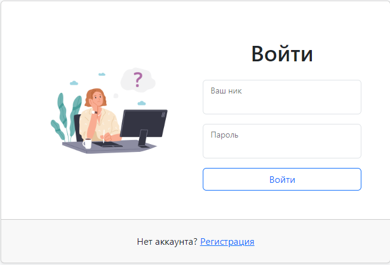
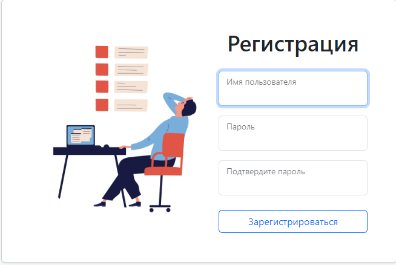
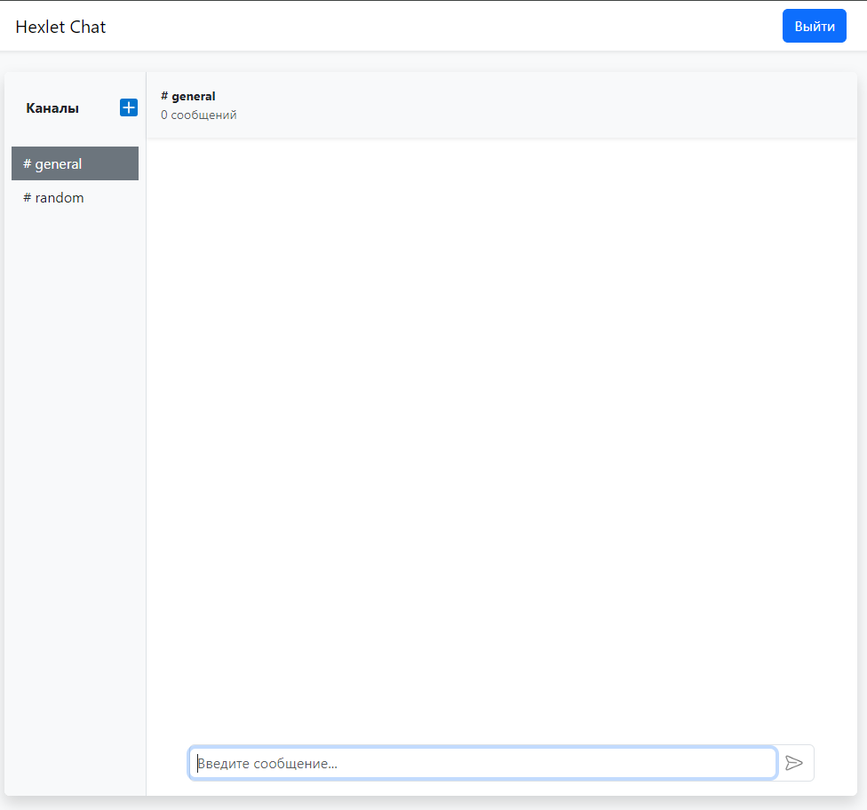

# Chat

### [Check this out on Render deploy](https://frontend-project-12-production-b37b.up.railway.app/)

[](https://github.com/KirillTheStranger/frontend-project-12/actions) [](https://github.com/KirillTheStranger/frontend-project-12/actions)

## Installation

To run this project locally use commands below.

```
make install \\ to install dependencies
```

```
make start \\ to run app
```

```
make start-frontend \\ to run frontend
make start-backend \\ to run server
```

## Usage

If you already have an account, login by filling loginpage-form.



To register new account use the form below. Simply enter your nickname, password and password confirm. <br>After that you will be automatically redirected to Homepage.



Feel free to chat, create new channels, edit them or even deleting.


